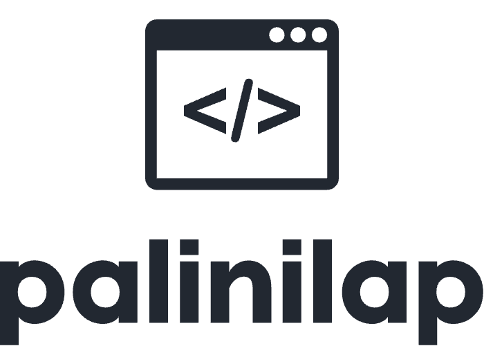

# Palinilap

  

**Palinilap** was created as a fun challenge to write a one-liner, weird, sometimes even ugly solution that checks if a given text is a palindrome-whether the text is your best friend in reverse.

## Requirements

To meet the challenge, the following criteria must be met:

- **One line of code** - Not two, not three, and certainly not an `if-else` spanning two pages. The code must be no longer than 1,000 characters.
- **Any programming language** - From Python to Brainfuck, feel free to use whatever language you like. If you can write it in machine or binary code, even better!
- **Functionality** - The code must work.
- **Honesty** - It has to be your own work. No hacker tricks.
- **Self-contained** - Everything required to run your solution should be in the repository. The jury shouldn’t have to add anything.
- **Documentation** - Your repository should include clear documentation, explaining the idea, the task, and how to compile/interpret and run your code. Add screenshots or links to videos demonstrating the solution if possible.

## Task

**Task 3**: Write a one-liner that checks whether the given text is your best friend (a palindrome).

## Solution

### Assumptions

Palindromes - those magical strings that read the same forwards and backward - are deceptively simple, but beneath the surface, lies a world of hidden complexity. It’s easy to think that checking if "madam" or "racecar" is a palindrome is straightforward, but let’s dive deeper, where the real magic happens.

First of all, **math**. Math is the mother of all science. The universe itself is built on numbers, and so is this palindrome solution. Palindrome check would be **nothing** without the concept of symmetry, which is rooted in the mathematical idea of reflection.

Now, we also can’t ignore **chemistry**. Chemistry involves all those strange, magical elements that shape the universe. In particular, let’s talk about **molybdenum**, element number 42 on the periodic table. And as we all know, 42 is *the answer to life, the universe, and everything*. So, is it any coincidence that molybdenum is essential here? Probably not. Some say its atomic structure can help stabilize palindromes on a quantum level, but let’s leave that for the conspiracy theorists.

But that’s not all - **Euler’s number (e)** must be included. You might wonder, “Why would a transcendental number that’s key to logarithms improve palindrome checking?” Well, that’s the beauty of it: sometimes we don’t have all the answers, but we know **Euler’s number** could increase the **accuracy** of this palindrome detector by... well, reasons. Is it provable? Not really. Does it add an air of mystery and a touch of magic? Absolutely.

### How to Run/Use?

#### Step 1: Clone the Repository

First things first, clone this repository to your local machine.

#### Step 2: Open the Files

Inside the cloned repository, you’ll find **two HTML files**:

1. **`palindrome.html`**: This is the **readable version** of palindrome checker. It’s designed to be clear and easy to understand, even for those who might not be code-savvy. Open it in any web browser, and you’ll see a friendly interface where you can input your text to check if it’s a palindrome. Feel free to explore the JavaScript and CSS to see how the magic happens behind the scenes!

2. **`palindrome.min.html`**: Here comes the fun part! This file contains the **minified and uglified version** of the same code. It’s all about fitting within the challenge requirements, so I stripped it down to its essentials, making it compact and efficient. While it might look like a jumbled mess, it’s doing the same heavy lifting as its more verbose sibling! Open this file in your browser, and test it out to see how it performs.

#### Step 3: Test It Out

- To test the palindrome functionality, simply type in any word or phrase in the provided input field and hit the check button. Watch as elegant algorithm springs to life and tells you whether your text is indeed a palindrome.

## Benchmark

To ensure the robustness and efficiency of palindrome solution, we put it to the test using the popular coding platform **LeetCode**, where coders from around the world tackle a vast array of programming challenges. Specifically, focusing on **Problem 125** (Valid Palindrome), which has garnered **3.5 million accepted solutions** out of **7.1 million total submissions**, reflecting an acceptance rate of **48.9%**.

### Performance

- **Runtime Speed**: Palinilap boasts a **runtime speed of 65ms**, placing it ahead of **49.31%** of all currently accepted submissions.

- **Memory Usage**: We achieved a **memory consumption of 53MB**, which beats **52.21%** of all submissions. Efficient memory usage is crucial, especially for larger inputs, so we’re proud of this accomplishment.

- **Edge Case Performance**: One of the standout features of solution is its ability to **successfully handle all edge cases**. Whether it’s an empty string, a single character, or a complex phrase laden with punctuation and spaces, palindrome checker stands resilient and delivers accurate results every time.

## Achievements

1. **Time Complexity**: The solution operates in linear time complexity, O(n).
2. **Space Complexity**: Code works in linear space complexity, O(n).
3. **Competitiveness**: Palinilap surpasses nearly half of all other known solutions in terms of performance.
4. **Browser Compatibility**: Supports browsers from Internet Explorer 6 (released August 24, 2001) to the latest versions of Chrome, Safari, and others.
5. **Availability**: Enables anyone with access to a web browser in the last 20+ years to check if their text is a palindrome. From Windows NT 4.0 (released August 24, 1996) and beyond.

## Conclusion

And there you have it! With just two simple HTML files, you’re all set to explore the world of palindromes. So, fire up your browser, input some texts, and let the palindrome magic unfold! 

## Disclaimer

This project was created purely for fun and should be treated as such. Use it, share it, but don’t take it too seriously!
